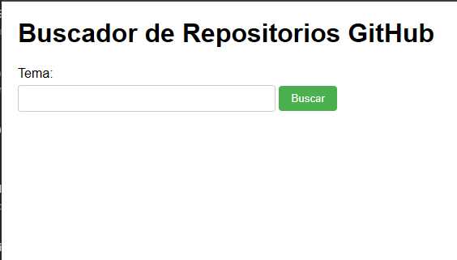

# 🔍 Awesome GitHub Search

> **Explora el universo de código** — Un buscador de repositorios minimalista y potente impulsado por la API de GitHub en tiempo real.

<!-- BADGES: Usa style=flat-square -->
[](https://ghsearch.is-a.dev/)
[](https://tailwindcss.com/)
[](LICENSE)

<p align="center">
  
</p>

---

## ✨ Características

| Característica         | Descripción                                                               |
| :--------------------- | :------------------------------------------------------------------------ |
| ⚡ **Búsqueda en Vivo** | Consultas en tiempo real a la API de GitHub para resultados instantáneos. |
| 🎨 **UI Moderna**       | Diseño limpio y minimalista construido con Tailwind CSS.                  |
| 📱 **Responsive**       | Adaptable a cualquier dispositivo, desde móviles hasta escritorio.        |
| 🔌 **Serverless**       | Funciona directamente en el navegador sin necesidad de servidor backend.  |
| 📊 **Datos Ricos**      | Muestra estrellas, descripciones y enlaces directos a los repositorios.   |

---

## 🚀 Inicio Rápido

### Requisitos
- Node.js & npm (solo para desarrollo de estilos)
- Navegador Web Moderno

### 1. Clonar el repositorio
Usa GitHub CLI para una experiencia optimizada:

```bash
gh repo clone herwingx/awesome-github-search
cd awesome-github-search
```

### 2. Instalar dependencias
Necesario para compilar los estilos de Tailwind CSS.

```bash
npm install
```

### 3. Desarrollo Local
Para observar cambios en CSS y regenerar los estilos automáticamente:

```bash
# En una terminal dedicada
npx tailwindcss -i ./src/input.css -o ./src/output.css --watch
```

Luego abre `index.html` en tu navegador o usa una extensión como Live Server.

---

## 🏗️ Arquitectura

La aplicación sigue una arquitectura SPA (Single Page Application) ligera sin dependencias de compilación complejas para el runtime.

```mermaid
graph TD
    User([👤 Usuario]) -->|Escribe Búsqueda| UI[💻 Interfaz Web]
    UI -->|Evento Input| JS[⚙️ Lógica (script.js)]
    JS -->|Fetch Request| API[☁️ GitHub REST API]
    API -->|JSON Response| JS
    JS -->|Update DOM| UI
    style UI fill:#f9f,stroke:#333
    style API fill:#bbf,stroke:#333
```

---

## 📦 Opciones de Despliegue

| Método           | Archivo            | Ideal para               |
| :--------------- | :----------------- | :----------------------- |
| **GitHub Pages** | `Settings > Pages` | Producción (Recomendado) |
| Local            | `index.html`       | Desarrollo / Pruebas     |

---

## 🔧 Comandos Útiles

```bash
# Compilar CSS para producción (minificado)
npx tailwindcss -i ./src/input.css -o ./src/output.css --minify

# Verificación de estilos
npm run test  # (Si está configurado)
```

---

## 🛠️ Stack Tecnológico

**Frontend**
- **HTML5**: Estructura semántica.
- **CSS3 (Tailwind)**: Estilizado utilitario y diseño responsivo.
- **JavaScript (ES6+)**: Lógica asíncrona y manipulación del DOM.

**Integraciones**
- **GitHub API**: Fuente de datos de repositorios.

---

## 🤝 Contribuir

1. Fork del repositorio
2. Crear rama: `git checkout -b feat/nueva-feature`
3. Commit: `git commit -m "feat: agrega búsqueda avanzada"`
4. Push: `git push origin feat/nueva-feature`
5. Crear Pull Request

## 📄 Licencia

Este proyecto está bajo la licencia MIT. Ver [LICENSE](LICENSE) para más detalles.

---

<p align="center">
  Hecho con ❤️ por <a href="https://github.com/herwingx">Eduardo Macías</a>
</p>
